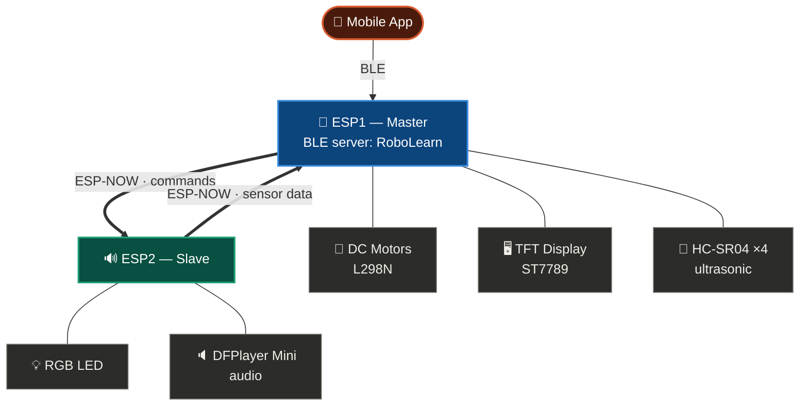
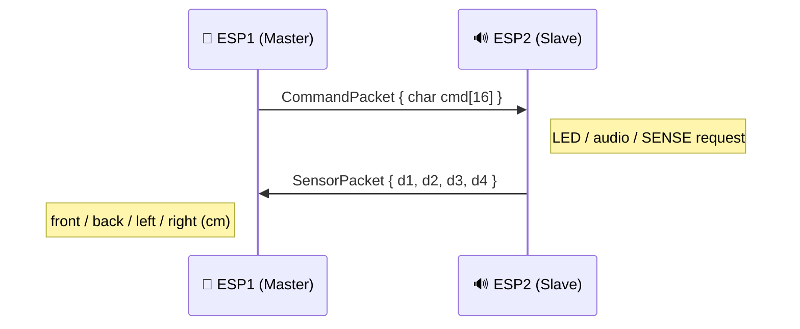

<div align="center">


# Interactive Robot for Programming Education

**A BLE‑controlled educational robot powered by two communicating ESP32 microcontrollers**

[](.)
[](.)
[](.)
[](.)
[](.)

🎓 **Senior Capstone Project** — Arab American University
Faculty of Engineering · Computer Systems Engineering

<br/>

| 🧑‍🏫 Supervisor | 🎓 Student | 🎓 Student | 🎓 Student |
|:---:|:---:|:---:|:---:|
| Dr. Sami Awad |Nour Albzoor | Diana Ghannam | Misk Haneef | 

</div>

<br/>

<div align="center">

### 🧭 Quick navigation

[Overview](#-overview) · [Architecture](#%EF%B8%8F-system-architecture) · [Repo structure](#-repository-structure) · [ESP1 Master](#-esp1--master) · [ESP2 Slave](#-esp2--slave) · [ESP-NOW protocol](#-espnow-communication) · [Build & flash](#%EF%B8%8F-building--flashing) · [Notes](#-notes)

</div>

<br/>

---

## 📖 Overview

IRFPE is a small robot used to teach programming concepts hands‑on. A companion mobile app sends commands over **Bluetooth Low Energy** to a master ESP32, which interprets them and either acts directly or relays the command over **ESP‑NOW** to a second ESP32 that drives the rest of the hardware.

The firmware is split into two independent Arduino sketches — one per chip.

<br/>

<table width="100%">
<tr>
<th width="50%">🧠 ESP1 — Master</th>
<th width="50%">🔊 ESP2 — Slave</th>
</tr>
<tr>
<td valign="top">

- 📡 BLE server — device name **`RoboLearn`**
- 🧭 Command parsing & routing
- 🚗 DC motors (L298N) + drift correction
- 📏 4× HC‑SR04 ultrasonic sensors
- 🖥️ ST7789 TFT display
- 🗺️ Grid position tracking & self‑correction

</td>
<td valign="top">

- 📶 ESP‑NOW command receiver
- 💡 RGB LED status feedback
- 🔈 DFPlayer Mini audio (8 tracks)
- 📤 Reports ultrasonic readings to ESP1

</td>
</tr>
</table>

<br/>

---

## 🗺️ System Architecture




## 📂 Repository Structure

```
ESP1_Master/
└── esp1/                        ← open in Arduino IDE
    ├── esp1.ino                    Setup / loop entry point
    ├── ble.cpp / ble.h             BLE server, command parsing, routing
    ├── espnow_master.cpp/.h        ESP-NOW init + send to ESP2
    ├── espnow_master_ext.cpp/.h    ESP-NOW receive callback (sensor data)
    ├── motors.cpp / motors.h       L298N driver + drift compensation
    ├── robot.cpp / robot.h         Grid position, heading, movement
    ├── position.cpp / position.h   Ultrasonic position verification
    ├── screen.cpp / screen.h       TFT graphics (faces, numbers, sunflower)
    └── commands.h                  Shared packet structs

ESP2_Slave/
└── esp2/                        ← open in Arduino IDE
    ├── esp2.ino                    Setup / loop entry point
    ├── espnow_slave.cpp / .h       ESP-NOW init + receive callback
    ├── rgb.cpp / rgb.h             RGB LED driver
    ├── audio.cpp / audio.h         DFPlayer Mini driver
    └── commands.h                  Shared packet struct
```

> 💡 **Why the nested folders?** The Arduino IDE requires a sketch's `.ino` file to sit in a folder with the *exact same name*. That's why `esp1.ino` lives in `ESP1_Master/esp1/` rather than directly in `ESP1_Master/`.

<br/>

---

## 🧠 ESP1 — Master

**Responsibilities**

- Hosts a BLE GATT server named **`RoboLearn`**
- Parses incoming commands and either:
  - executes them locally (screen graphics, robot movement), or
  - forwards them to ESP2 over ESP‑NOW (LED, audio)
- Drives two DC motors via L298N, with a tunable compensation delay (`MOTOR_B_EXTRA_MS`) to correct for Motor B being weaker than Motor A — keeps the robot driving straight
- Tracks grid position (`robot.cpp`) and self‑corrects using ultrasonic readings pulled from ESP2 (`position.cpp`)
- Drives a 2.4" ST7789 TFT for visual feedback — numbers, faces, sunflower growth stages

<br/>

**📡 BLE service**

| | UUID |
|---|---|
| Service | `12345678-1234-1234-1234-123456789001` |
| Characteristic (write) | `12345678-1234-1234-1234-123456789002` |

<br/>

**⌨️ Command reference — handled directly on ESP1**

| Command | Action | Returns |
|:---:|---|:---:|
| `SUN` | Show sun graphic | — |
| `SLF` | Show seedling graphic | — |
| `LF` | Show young leaves graphic | — |
| `SFL` | Show full sunflower graphic | — |
| `HPY` | Show happy face | — |
| `SAD` | Show sad face | — |
| `D0` `D1` `D2` `D3` `D5` `D10` | Show number on screen | — |
| `CLR` | Clear / reset screen | — |
| `MF` | Move forward one cell | — |
| `MB` | Move backward one cell | — |
| `TR` | Turn right 90° | — |
| `TL` | Turn left 90° | — |

> Anything else is forwarded as‑is to ESP2 over ESP‑NOW.

<br/>

<details>
<summary><b>🔌 Pin map — Motors (L298N) &amp; TFT (ST7789)</b></summary>
<br/>

| Motor signal | GPIO |
|:---:|:---:|
| ENA | 33 |
| ENB | 13 |
| IN1 | 25 |
| IN2 | 26 |
| IN3 | 27 |
| IN4 | 14 |

| TFT signal | GPIO |
|:---:|:---:|
| CS | 22 |
| RST | 17 |
| DC | 16 |

</details>

<br/>

---

## 🔊 ESP2 — Slave

**Responsibilities**

- Receives commands from ESP1 over ESP‑NOW and executes them
- Drives an RGB LED for status feedback
- Drives a DFPlayer Mini for audio feedback (8 tracks)
- Reports ultrasonic sensor readings back to ESP1 on request, for grid position verification

<br/>

**⌨️ Command reference — handled on ESP2**

| Command | Action |
|:---:|---|
| `LR` | RGB LED red |
| `LG` | RGB LED green |
| `LB` | RGB LED blue |
| `LY` | RGB LED yellow |
| `SRGB` | RGB LED off |
| `PL1`–`PL8` | Play audio track 1–8 |
| `SP` | Stop audio |

<br/>

<details>
<summary><b>🔌 Pin map — RGB LED &amp; DFPlayer Mini</b></summary>
<br/>

| RGB signal | GPIO |
|:---:|:---:|
| RED | 14 |
| GREEN | 12 |
| BLUE | 13 |

| DFPlayer signal | GPIO |
|:---:|:---:|
| RX (ESP2 receives) | 27 |
| TX (ESP2 transmits) | 26 |

</details>

<br/>

---

## 📶 ESP‑NOW Communication

ESP1 and ESP2 talk directly over ESP‑NOW — no Wi‑Fi router needed.



| Direction | Packet | Purpose |
|---|---|---|
| ESP1 → ESP2 | `CommandPacket { char cmd[16] }` | LED, audio, and `SENSE` requests |
| ESP2 → ESP1 | `SensorPacket { float d1, d2, d3, d4 }` | Front / back / left / right ultrasonic distances |

> ⚠️ Each board's MAC address is hard‑coded as the peer address on the other side (`slaveAddress[]` in `espnow_master.cpp`). If you re‑flash either board, verify the peer MAC still matches — print `WiFi.macAddress()` over Serial to check.

<br/>

---

## ⚙️ Building & Flashing

**📦 Required libraries**

| Library | Used by |
|---|:---:|
| `BLEDevice` / `BLEServer` / `BLEUtils` | ESP1 *(ESP32 core)* |
| `Adafruit_GFX` | ESP1 |
| `Adafruit_ST7789` | ESP1 |
| `DFRobotDFPlayerMini` | ESP2 |
| `esp_now` / `WiFi` | Both *(ESP32 core)* |

<br/>


1. Open `ESP1_Master/esp1/esp1.ino` in Arduino IDE → select your ESP32 board → flash the master unit
2. Open `ESP2_Slave/esp2/esp2.ino` in Arduino IDE → select your ESP32 board → flash the slave unit
3. Verify the MAC address hard‑coded in `espnow_master.cpp` matches the slave board
4. Pair the mobile app with the **`RoboLearn`** BLE device and start sending commands 🚀

<br/>

---

## 📝 Notes

- The 4×4 grid and expected ultrasonic distances in `position.cpp` assume a **120×140 cm** track with a fixed robot orientation — recalibrate `EXPECTED[][]` if the track changes.
- `MOTOR_B_EXTRA_MS` in `motors.h` tunes forward/backward drift correction — adjust for a different chassis or motor pair.

<br/>

---

<div align="center">

*Built with ❤️ as part of a senior engineering capstone project.*

<sub>Arab American University · Faculty of Engineering · Computer Systems Engineering</sub>

</div>
